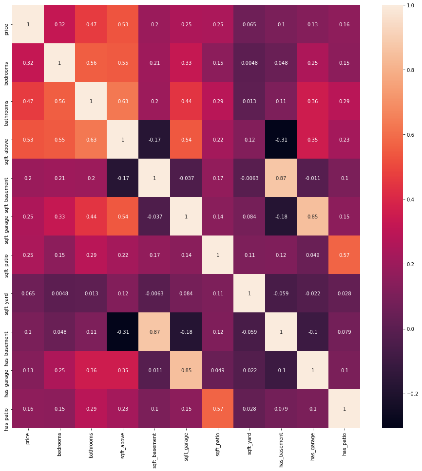
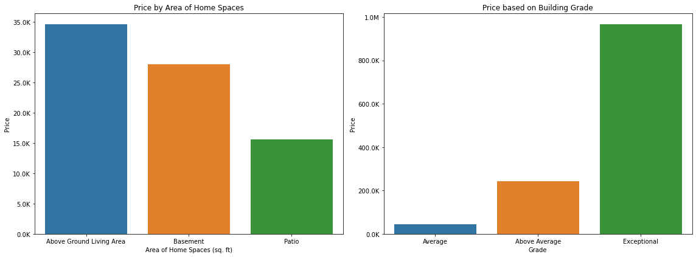
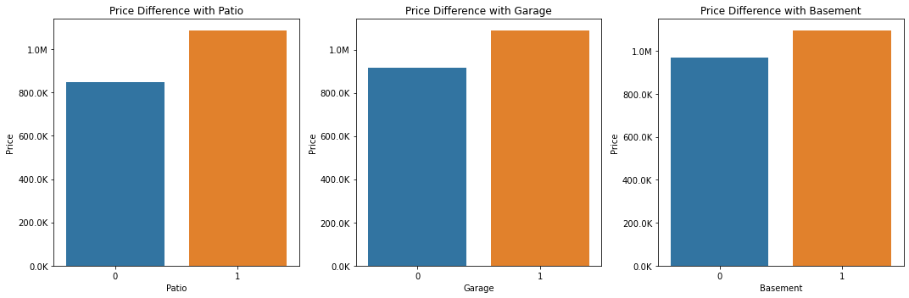
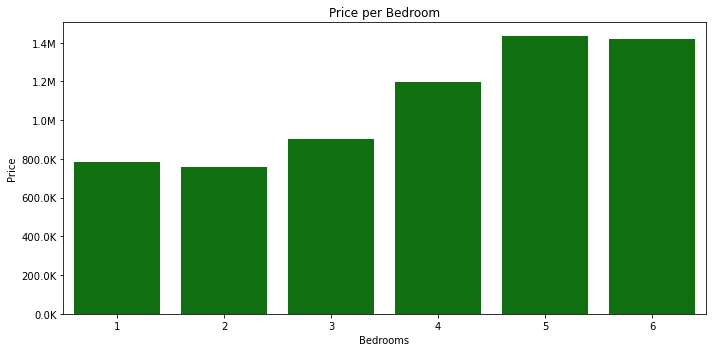
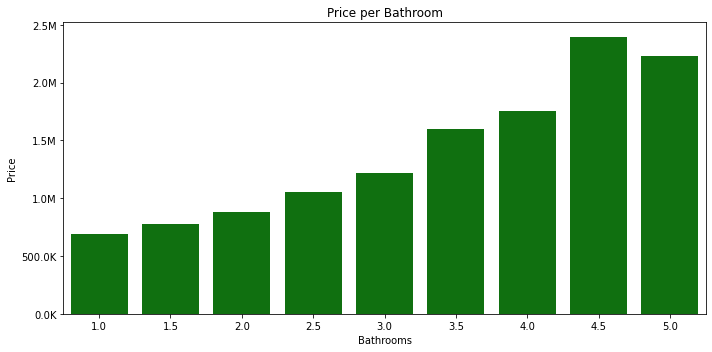

 <font size = +2><center><u>Home Renovation and House Sales in King County</u></center></font>

Authors: [Roshni Janakiraman](mailto:roshnij618@gmail.com), [Michael Licul](mailto:liculm315@gmail.com), & [Jose Castillo](mailto:114josecastillo@gmail.com)

  

# Overview
As consultants for a home renovation company, we sought out to determine the types of home renovations that are most associated with increased house sale price. Using data from all house sales during 2021 in King County, we used regression models to determine the following:
    
1. Which living space expansions are associated with higher sale price?
2. Which types of room additions can increase a house's sale value?
3. Does build quality contribute to higher sale value, above and beyond expanded living space?
    
Our results and recommendations are presented below.


# Business Case

* As a Construction Consulting firm, Royal Advisory helps new home renovation businesses establish themselves in the Seattle market.
  
 * With the housing market is cooling rapidly in Seattle, homeowners are increasingly opting to invest in remodeling their current home instead of buying new properties. Given this [increase in demand](https://www.king5.com/article/money/markets/real-estate/seattle-home-renovation-housing-cooldown/281-71cb28a8-1bd5-4187-955f-debad072fe53), now is the perfect time for a home renovation company to move into the Seattle area. 
  
* A new home renovation company, Home Remedies, hired us to recommend the best services to offer clients who are looking to increase the sale value of their homes. 

## Defining Types of Remodeling Projects

 * First, based on [industry definitions](https://www.homeadvisor.com/cost/additions-and-remodels/), we identified the major components of home remodeling projects:
     1. **Home Renovations:** Updating the quality of the house's building material
     
     2. **Home Remodeling:** Increasing the size of your home, either through extensions or additions:  
         2a. *Home Extensions:* Increasing the size of existing section of the house 
         2b. *Home Additions:* Adding a new section to your home 
     
We were then guided by these business questions:

## Business Questions

1. For all clients interested in home remodeling (increasing the area of your house, either through *home extensions* or *home additions*, where are the best areas to add square footage?
    - Which areas of the house is increased area associated with increased sale value?

2. For clients specifically interested in *home additions*, what are the best structures to add to increase the sale value of their house?
    - What types of home additions contribute to a higher sale price?

3. How much do renovations contribute to the sale price of a house? Should clients add build quality renovation projects to their home remodeling projects to increase their house's value?

## Data Source & Relevance to Business Case

As a Seattle-based company, Home Remedies needs to understand the sale trends in the King County, Washington area. The [dataset we used](https://kingcounty.gov/services/data.aspx) consists of data from all 2021 house sales in King County (n = 30155). A data glossary is available [here](https://info.kingcounty.gov/assessor/esales/Glossary.aspx?type=r)

This data allows us to see what *features of a house* contributed to house sale price in 2021. From this, we can infer what types of house changes could increase future house sale price

## Why Linear Regression Models?

* Regression coefficients allow us to see how the different parts affect the whole.
* Since nothing operates in isolation in the real world, it's important to see how different variables interact with each other to affect the outcome.
* This is where regression is useful: regression tells you how much each quality contributes to the outcome
    * For this case: this will allow us to prioritize searching for the best possible investments.
* Not only can we directly compare different variables, but also, we can see what combinations of variables allow us to achieve the desired result (highest sale price)

***

# Features of Interest to Answer Current Questions:

 * **Remodeling** *(increasing area of house, either by extending existing space or adding new space)*:
    1. Living Space (Total Living Space: Space physically within the "house")
        * Above-Ground Living Space (sqft_above)
        * Basement (sqft_basement)
    2. Garage Space (sqft_garage)
    3. Patio Space (sqft_patio)
    4. Yard Space (sqft_yard; will calculate from given variables)  
    
    
 * **Addition** *(adding a new room/section to house)*:
    1. Number of Bathrooms
    2. Number of Bedrooms
    3. Has Garage (binary calculated from sqft_garage: yes/no)
    4. Has Patio (binary calculated from sqft_patio: yes/no)
    

 * **Renovation** *(upgrading building quality)*:
    1. Grade

# Data Preparation

Please see our Jupyter Notebook for a walkthrough on our data preparation process.

## General Steps
1. Excluded Irrelevant Variables
2. Calculated New Variables
- There were several Features of Interest that were not readily available in our dataset, but that we derived through either calculating or converting available variables:
    a. Yard Space: we estimated yard space based on [architect definitions](https://www.yourownarchitect.com/what-is-the-difference-between-floor-area-and-lot-area/) and [Seattle permit regulations](https://www.seattle.gov/DPD/Publications/CAM/cam220.pdf) clarifying what is (and isn't) included in lot area calculations. We determined the following formula to conservatively estimate yard space:
        Yard Space = Lot Space - Ground Floor Living Space
        Yard Space = Lot Area - (Above Ground Living Space/Number of Floors)

We used continuous measures of area to determine the following binary variables:
    b. House has Basement (yes/no)
    c. House has Patio
    d. House has Garage

3. Categorical Variables: Removed Outliers and Adjusted Bin sizes
4. Continuous Variables: Removed Outliers based on a combination of the IQR method and z=3 cutoff method.

Below are graphs of our continuous and categorical variables:

  

More descriptive statistics and visualizations can be found in our Jupyter notebook. The heat map below showsthe correlations between continuous variables:

    

# Modeling

## Model 1: Effect of Area of Home Spaces on Price

### **Question we are trying to answer:**
For which home spaces are *increased size* associated with *higher sale value?*

#### Baseline Model - Price based on Above-Ground Living Area (Sq.Ft)

* For our baseline model, we decided to start with Above Ground , because:
    1. Highest correlation on heatmap
    2. Relevant to answering questions about area

* Iterative models allow us to see the relative value that each location's area adds.

**4 Iterations:**
 1. Add sqft_basement
 2. Add sqft_garage
 3. Add sqft_patio
 4. Add sqft_yard

Please refer to our Jupyter notebook for detailed steps on each iteration and linear assumption testing.

### Model 1 - Final
* Outcome: Price
* Explanatory Variables: 
    * Above Ground Living Area, Basement Area, Garage Area, Patio Area
    
    * Excluded from model: Yard Area (insignificant) 
***
## Model 2: Effect of Grade on Price

1. We first started with a simple linear regression exploring the effect of building grade on price.

2. Based on our results, we decided to add Building Grade to our original regression in Model 1
***

## Model 3:

We used 3 models to address the question on Housing Additions on Price, which we grouped together as "Model 3"

1. First, we ran a regression looking at the effect on house sale price of adding auxiliary structures (patio, garage, or basement).

2. Next, we looked at the effect of number of bedrooms on house sale price.

3. Finally, we regressed number of bedrooms over house sale price.

***
# Results: Interpreting Final Models

* The final versions of Models 2 and 3 can be used to answer our business questions.

## Answering Question 1:

* Question 1: Which *common house spaces* would *increased size* contribute to increased house prices? 

* Our regression model showed us the relationship between square footage of common house areas and house sale price
    
**Results:**
* R<sup>2</sup> = 0.45, meaning that the current model explains 45% of the variance in house sale prices.

**Interpreting Coefficients:**
* Expanding the Above-Ground Living Space by 100 Sq Ft is estimated to increase sale prices by 34.6k
* Expanding the Basement space by 100 sq ft is estimated to increase sale prices by 28k
* Expanding one's Patio space by 100 sq ft is estimated to increase sale prices by 15.6k

  

## Answering Question 2:

Question 2: How much does *building quality* contribute to increased home prices? Is it worth adding renovation projects onto expansion projects?

* Improving the house's build quality from Below Average to Average is estimated to increase sale price by 43.5k
* Improving the house's build quality from Below Average to Above Average is estimated to increase sale price by 242.3k
* Improving the house's build quality from Below Average to Exceptional is estimated to increase sale price by 967.5k
***

## So, based on Model 2, what should Home Remedies tell their clients?

1. If clients want to optimally increase the sale value of their homes, the best expansion project would be to **expand above-ground living space** 

2. Increasing basement space and increasing patio space are also valuable investments associated with increased sale value. Clients who have a preference for either of these two options can still increase the value of their home's sale price. 

3. It is not a wise idea for clients to expand garage space, as this is associated with *decreased* house value. It is also not wise for clients to increase yard space, as this only has a minor effect on sale price. Clients should be advised against expanding their yard space and garage space. 

4. For the typical homeowner, increasing build quality can significantly increase the house's sale value.

5. Increasing the build quality of a home is a worthwhile project to combine with house expansion projects-- this is the best way a client to optimize getting the best value out of their construction investments.

## Model 3: Final - Results

Model 3 addresses Question 3:

* Which room addition contributes to increased house sale value?

**Features examined in Model 3:** <br> 
a. Whether or not these spaces were present in a house:
- Has Garage (Yes/No)
- Has Basement (Yes/No)
- Has Patio (Yes/No)<br>

b. The number of bedrooms in a house
 
c. The number of bathrooms in a house
***

## Model 3a: Auxillary House Additions & House Sale Price 
    

    
* Model 3a accounted for 5% of the variance in house sale prices (R<sup>2</sup> = 0.05)
    * Since the R<sup>2</sup> value is so low, results should be interpreted with caution


All of the coefficients had a significant effect in the model (p < 0.05):
* Houses with patios were valued at a **207k** higher selling price than houses that did not have garages.
* Houses with garages were valued at a **168k** higher selling price than houses that did not have garages.
* Houses that had a basement were valued at a **127k** higher selling price than houses that did not have a basement.

## Model 3b: Number of Bedrooms & House Sale Price
    
    

* Model 3b accounts for 11% of the variance in sale prices (R<sup>2</sup> = 0.11).

Coefficient interpretation:
* Upgrading to 2 Bedrooms from 1 Bedroom does not seem to have a significant relationship with price (p = 0.524).
* Upgrading to 3 Bedrooms from 1 Bedroom is estimated to increase house sale value by **123k**
* Upgrading to 4 Bedroms from 1 Bedroom is estimated to increase house sale value by **414k**
* Upgrading to 5 Bedrooms from 1 Bedroom is estimated to increase house sale value by **651k**
* Upgrading to 6 Bedrooms from 1 Bedroom is estimated to increase house sale value by **636k**

## Model 3c: Number of Bathrooms and House Sale Price
    

    
* Model accounts for 25% of the variance in price (R2 = 0.25)

All of the coefficients had a significant effect in the model (p < 0.05):
* Adding a half bathroom (1.5 Ba) to a 1 bathroom house is associated with an 86k increase in sale price

Each half (or full) bathroom is associated with a higher increase in price, until...

* Adding a half bathroom (4.5 Ba) to a 4 bathroom house is associated with a 639k increase in price

* Adding a full bathrom (5 Ba) to a 4 bathroom house is assocaited with a 474k increase in price 
    
In summary: returned value on investment steadily increases until 5 bathrooms, when it declines.  
***

## The advice that Home Remedies should give their clients, based on Model 3:

1. Adding a basement/patio/garage is estimated to significantly increase the sale value of a house, *if the house does not already have these spaces*
     * Clients interested in adding a garage would benefit from keeping it as small as possible.
    
2. Adding a bathroom has a stronger relationship (R<sup>2</sup> = 0.24 > 0.11) and generally offers stronger returns (based on coefficients) compared to adding a bedroom.
<br>

3. However, adding a bedroom is still a reasonable investment that is generally associated with higher sale price.

# Conclusions

## Summary of Recommendations for Home Remedies:

* Overall, our models support the benefit of home renovation on house sale prices.

* The following recommendations will help your clients make informed decisions on upgrading their houses to stay competitive in the real estate market.


**1. Expanding Existing Spaces**
<br>

1. Profitable Options:
    1. **Above-Ground Living Space**: $346 per square foot
    2. Basement Space: $280 per square foot
    3. Patio Space: $155 per square foot
    <br>  
2. *Unprofitable* investments to *avoid*:
    1. **Garage**: *Loss* of $266 per square foot
    2. **Yard**: weak association with sale price


**2. Renovation (Improving Build Quality)**
<br>

1. Profitable option to pair with space expansions
2. Also profitable on its own
3. Depending on current build quality, can estimate increase in price anywhere from $43k to $923k

**3. Adding Room/Home Spaces**

1. Adding half-bath or full bathroom: anywhere from $86k-639k increase in sale price
* Max sale price increase is at 4.5 Bathrooms. Might not be worth upgrading to 5 Bathrooms.
   
2. Adding Bedrooms: anywhere from $123k to 650k increase *EXCEPT:*
    * Not Profitable to go from 1 Bedroom to 2 Bedrooms, or from 5 Bedrooms to 6 Bedrooms.

3. Adding Auxillary Spaces:
    1. Patio Space: $207k increase <br>
    2. Garage : $168k increase <br>
    3. Basement: $127k increase <br>
 
___

## Limitations & Next Steps

1. Our models are limited by low R<sup>2</sup> values. None of our independent variables explained a significant portion of the variance in house sale price. 
    - This could be because of the high variability of both our outcome and predictor variables.
    - This limits our confidence in the value of the regression coefficients.
    - In the future, the variables that we excluded in the beginning could be incorporated in the models as control variable.
    
2. Further limited by violating assumptions of linear regression models
    - It is possible another type of model could be better for explaining these relationships.
    
3. Value of sqft_yard is a rough estimate
    - The city of Seattle does not count garages/patios as part of sqft_lot, but that could be different in the suburbs
    - The fact that we had negative values, a physical impossibility, suggests that either the data is incorrect, or estimation method was flawed
    - Useful data for King County to consider including in the future
---
# For More Information

See the full analysis in the [Jupyter Notebook](./Home_Renovations_and_Sale_Prices_in_King_County.ipynb) or review this [presentation](./presentation.pdf).

**For additional info, contact:**<br>
* [Roshni Janakiraman](mailto:roshnij618@gmail.com) <br>
* [Michael Licul](mailto:liculm315@gmail.com) <br>
* [Jose Castillo](mailto:114josecastillo@gmail.com)


## Repository Structure

```
├── scratch_notebooks
│   ├── Mike Notebook.ipynb
│   ├── rj_scratch.ipynb
├── images
│   ├── cinema.jpeg
│   ├── director_shot.jpeg
│   ├── figure1.png
│   ├── figure2.png
│   ├── figure3.png
│   └── jheader.png
├── Data
│   ├── column_names.md
│   ├── kc_house_data.csv
├── Home_Ren_Sales_King_County.ipynb
├── presentation.pdf
└── README.md
```


